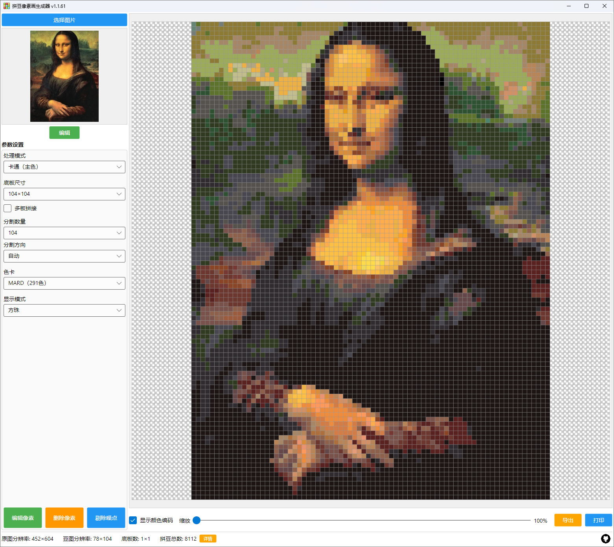
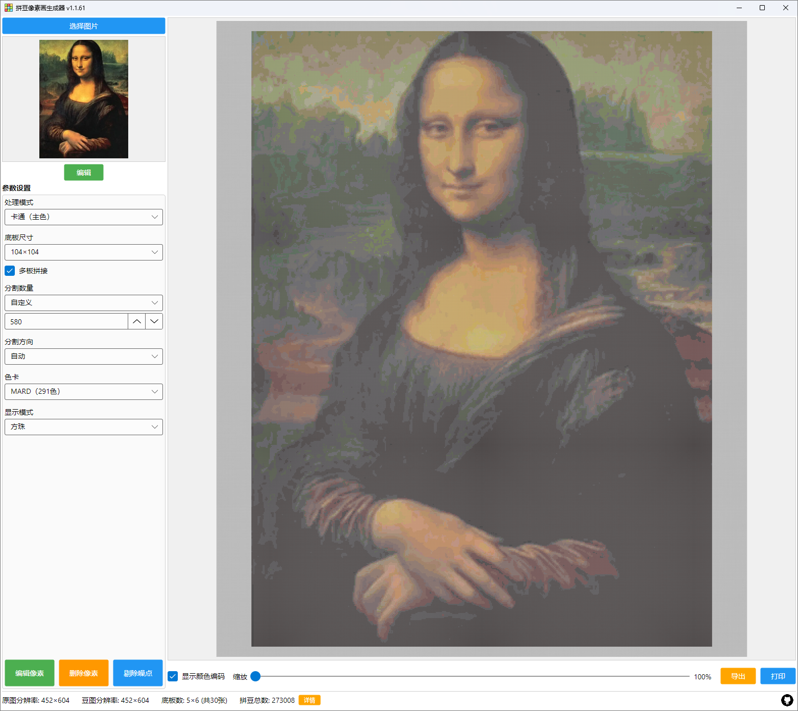

# 拼豆像素图生成器

带闺女玩拼豆的时候，需要自己弄适合拼豆的像素画。尝试了几个生成器，要么不好用，要么功能补全。于是就有这个项目

> 所有代码都是 GLM-5.2 完成的，我一行代码都没看过

## 拼接方式

支持两种图像拼接模式：单板和多板，勾选“多板拼接”选项即启用多板模式

- 单板模式

    像素化后的图像能在一张底板上拼完，也就是说图像的最大分辨率不超过所选底板的分辨率

    

- 多板模式

    像素化后的图像的大分辨率如果超过所选底板的分辨率，会通过拼接多张底板来容纳所有像素

    

## 图像处理

- 编辑像素
- 删除像素
- 剔除噪点

## 导出与打印

像素画支持 4 中导出格式

- PNG
- JPG
- SVG
- PDF

同时，支持直接打印

> 理论上支持多平台打印，但实际仅在 windows 平台下测试过